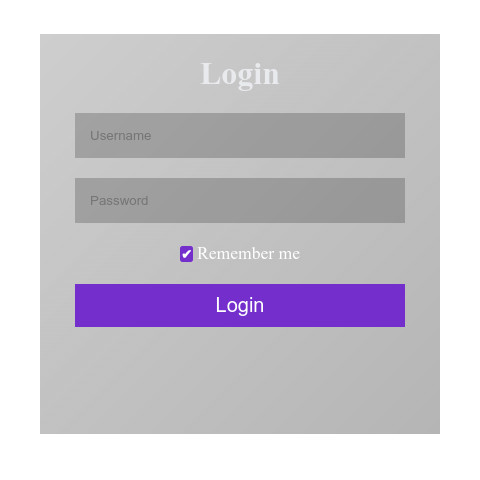
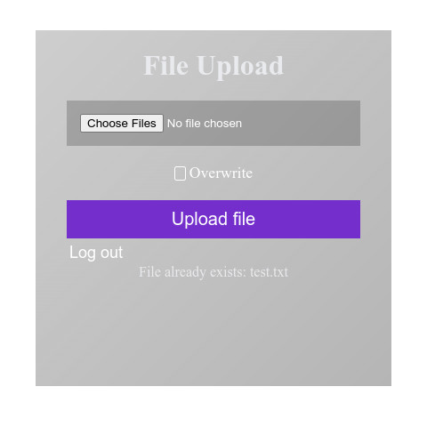
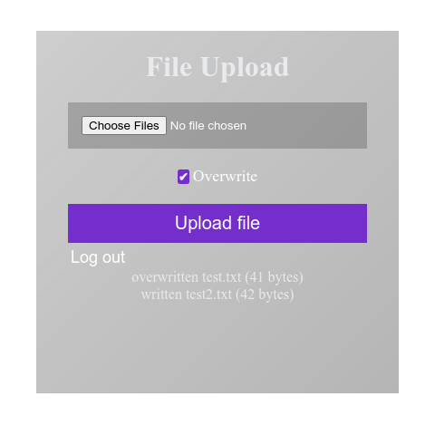

    
    
    

## CGI File Upload
Simple file uploading webpage backend with no clientside JS, JQuery or Wasm. \
To check credentials, it looks for *(UserDir)/(username).txt* file which contains a sha256sum of the password. Also has the option to store the username and hashed password as cookies. \
Then it tries to write the file(s) in *(StorageDir)/(username)/(the_file)*. If Overwrite is checked, it will overwrite existing files, otherwise it will skip them. \
StorageDir and UserDir are empty strings by default, making them relative paths. You can change them in main.go to use absolute paths.

Since the whole content of the file(s) is stored as a string in memory, it is quite limited. Since there's no way of tracking the upload progress, uploading big files gives no feedback to the user until they're done uploading.

## Building and Useage
To build, just run `go build -o upload .`

You can use it with Nginx and a CGI wrapper such as fcgiwrap. \
Make sure the fcgiwrap unix sock file is owned by an user which can write to the StorageDir. Also make sure nginx can access the socket.

You can also use apache2, but I have no experience using it.

## TODO
- [x] Handle existing files (ask to override)
- [x] optionally store login client side, **only store password hash**
- [ ] UI to browse, download and delete files
