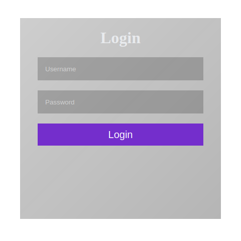
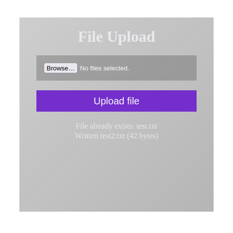

    
    

## CGI File Upload
Simple file uploading webpage backend with no clientside JS, JQuery or Wasm. \
To check credentials, it looks for (UserDir)/(username).txt file which contains a sha256sum of the password.
Then it tries to write the file(s) in (StorageDir)/(username)/(the_file). \
StorageDir and UserDir are empty strings by default, making it a relative path. You can change them in main.go to use absolute paths.

Since the whole file is stored in a string in memory, it is quite limited. Uploading big files a bit weird since there's no way of tracking the upload progress.

## Building and Useage
To build, just run `go build -o upload .`

You can use it with Nginx and a CGI wrapper such as fcgiwrap. \
Make sure the fcgiwrap unix sock file is owned by an user which can write to the StorageDir. Also make sure nginx can access the socket.

You can also use apache2, but I have no experience using it.

## TODO
- [ ] Handle existing files (ask to override)
- [ ] optionally store login client side *only store password hash*
- [ ] UI to browse, download and delete files
